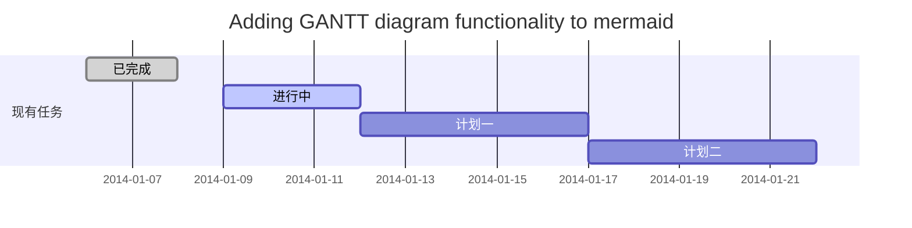
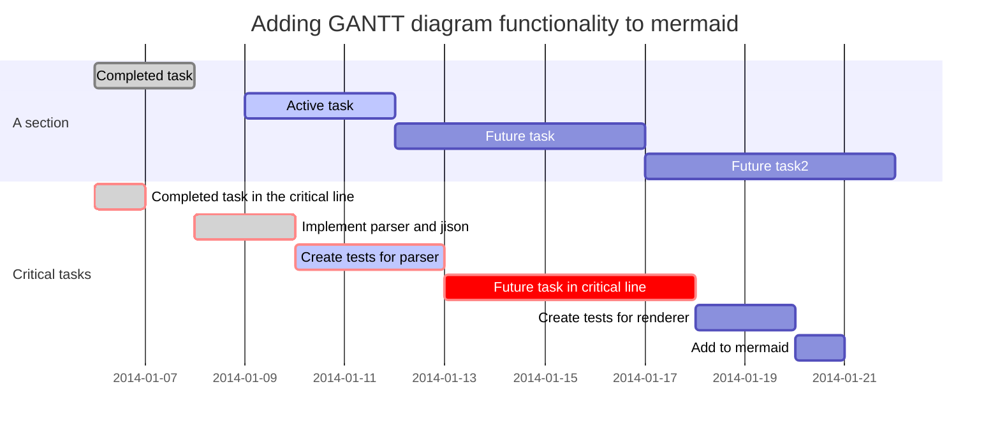

# 欢迎使用Markdown编辑器

## 如何改变文本的样式

*强调文本* _强调文本_

**加粗文本** __加粗文本__

==标记文本==

~~删除文本~~

> 引用文本

## 插入链接与图片

链接: [link](https://mp.csdn.net).

图片: 


## 如何插入一段漂亮的代码片

```python
# An highlighted block
print('a pig')
```

## 生成一个适合你的列表

- 项目
  - 项目
    - 项目

1. 项目1
2. 项目2
3. 项目3

- [ ] 计划任务
- [x] 完成任务

## 创建一个表格
一个简单的表格是这么创建的：
项目     | Value
-------- | -----
电脑  | $1600
手机  | $12
导管  | $1

### 设定内容居中、居左、居右

使用`:---------:`居中

使用`:----------`居左

使用`----------:`居右
| 第一列       | 第二列         | 第三列        |
|:-----------:| -------------:|:-------------|
| 第一列文本居中 | 第二列文本居右  | 第三列文本居左 | 


## 创建一个自定义列表
?

## 如何创建一个注脚

?

##  注释也是必不可少的

?

## KaTeX数学公式

您可以使用渲染LaTeX数学表达式 [KaTeX](https://khan.github.io/KaTeX/):

Gamma公式展示 $\Gamma(n) = (n-1)!\quad\forall
n\in\mathbb N$ 是通过欧拉积分

$$
\Gamma(z) = \int_0^\infty t^{z-1}e^{-t}dt\,.
$$

> 你可以找到更多关于的信息 **LaTeX** 数学表达式[here][1].

## 新的甘特图功能，丰富你的文章




